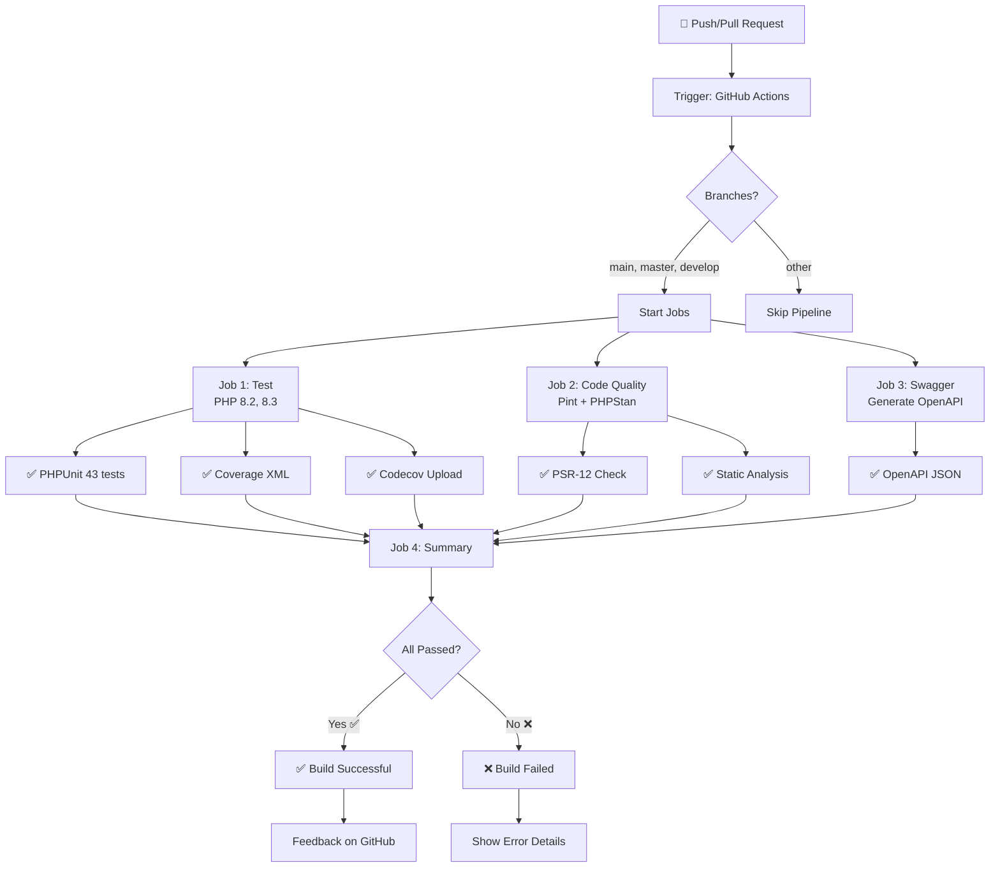

# CI/CD Pipeline - Visual Guide

## 🔄 Fluxo do Pipeline



## 📊 Job Details

### Job 1: Test (Matrix: PHP 8.2, 8.3)

```
┌─────────────────────────────────┐
│        Setup PHP 8.2            │
├─────────────────────────────────┤
│ • Install extensions            │
│ • Setup coverage (Xdebug)       │
│ • Cache Composer                │
│ • Install dependencies          │
│ • Setup database (:memory:)     │
│ • Run migrations                │
│ • Execute PHPUnit               │
│ • Upload coverage               │
└─────────────────────────────────┘

┌─────────────────────────────────┐
│        Setup PHP 8.3            │
├─────────────────────────────────┤
│ (Mesmos passos que 8.2)         │
└─────────────────────────────────┘
```

### Job 2: Code Quality

```
┌──────────────────────────────┐
│  Setup PHP 8.2               │
│  • Laravel Pint --test       │  PSR-12 Compliant
│  • PHPStan analysis          │  Static Analysis
└──────────────────────────────┘
```

### Job 3: Swagger

```
┌──────────────────────────────┐
│  Setup PHP 8.2               │
│  • l5-swagger:generate       │  Generate OpenAPI
│  • Verify openapi.json       │
└──────────────────────────────┘
```

### Job 4: Summary

```
Depende de: test + code-quality + swagger
├─ Falha se algum job falhar
├─ Passa se todos bem-sucedidos
└─ Consolidar status final
```

---

## 🎯 Timeline

| Etapa | PHP 8.2 | PHP 8.3 | Code Quality | Swagger | Summary |
|-------|---------|---------|--------------|---------|---------|
| 0-10s | Setup   | -       | Setup        | Setup   | Waiting |
| 10-20s| Install | Setup   | Install      | Install | Waiting |
| 20-60s| Test    | Install | Pint         | Generate| Waiting |
| 60-80s| Coverage| Test    | PHPStan      | Check   | Waiting |
| 80s+  | Done ✅  | Coverage| Done ✅      | Done ✅  | **Done ✅** |

**Total:** ~2-3 minutos

---

## 📈 Statusbar no GitHub

### ✅ Sucesso

```
✓ All checks have passed
  ✓ test (8.2) — 40s
  ✓ test (8.3) — 45s
  ✓ code-quality — 30s
  ✓ swagger — 25s
  ✓ summary — 5s
```

### ❌ Falha

```
✗ Some checks failed
  ✓ test (8.2) — 40s
  ✗ test (8.3) — FAILED
  ✗ code-quality — FAILED
  ✓ swagger — 25s
  ✗ summary — SKIPPED
```

---

## 🔧 Configuração

### Triggers

```yaml
on:
  push:
    branches: [main, master, develop]
  pull_request:
    branches: [main, master, develop]
```

### Environment

```yaml
PHP Matrix: [8.2, 8.3]
OS: ubuntu-latest
Database: SQLite (memory)
Cache: Composer
Coverage: Xdebug
```

---

## 📊 Matriz de Compatibilidade

| PHP | OS | Status |
|-----|-----|--------|
| 8.2 | ubuntu-latest | ✅ Tested |
| 8.3 | ubuntu-latest | ✅ Tested |
| 7.4 | ❌ Not in matrix | Use locally |

---

## 🎬 Exemplo de Execução

### Comando local (usando Act)

```bash
act push \
  -W .github/workflows/ci.yml \
  -e github-event.json \
  -j test
```

### Output esperado

```
[ci/test] ✓ Run PHPUnit Tests
  ✓ PASS app/Tests/Feature/ProductTest.php
  ✓ PASS app/Tests/Feature/OrderTest.php
  ✓ PASS app/Tests/Unit/ServiceTest.php
  
  Tests: 43 passed, 0 failed
  Coverage: 78.5%
```

---

**Versão:** 1.0.0  
**Status:** ✅ Production Ready  
**Última Atualização:** Junho 2026
